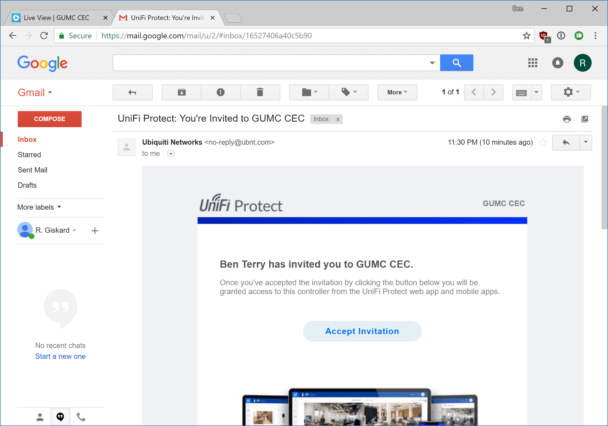

# UniFi Protect - Accept Invite

If you have been invited to the CEC UniFi Protect system (security camera system), this guide will walk you through getting access to the system.

### Types of UFP accounts:

There are two ways to log into the UFP system: Ubiquiti accounts and local accounts. If you were invited by email address, you will need to create a Ubiquiti account to use to log in. If a local account was created for you, you will not have received an email and will need to use the username/password given to you. Local accounts can be used [here](https://10.0.0.4:7443) when on the CEC staff network only. Ubiquiti accounts are recommended over local accounts.

If you received an email invite, the rest of this guide will walk you through getting access to the system.

## Accepting an email invite to UFP:

1. Check your email inbox for your invitation email. Invite speed varies with email provider, but invitations usually show up within 10 minutes. You can ask a UFP administrator to resend your invite if needed.
   

   

2. At the blue UniFi Protect welcome screen, click the **Ubiquiti** sign in button. If you already have a Ubiquiti account, sign in. If you need to create an account, click the **Create Account** button in the lower part of the login pane. For best results, use the same email for you account as was invited to the CEC UFP system.
   

3. If you are not logged into the UFP system after account creation, follow [this guide](ufp-login.html) to log in. You may need to verify your account after creation; check your inbox for a verification email.

------

[Back to UFP Docs list](https://BLTsndwch.github.io/GUMCdocs/UFPdocs/index.html)

*Updated 2018-08-12*