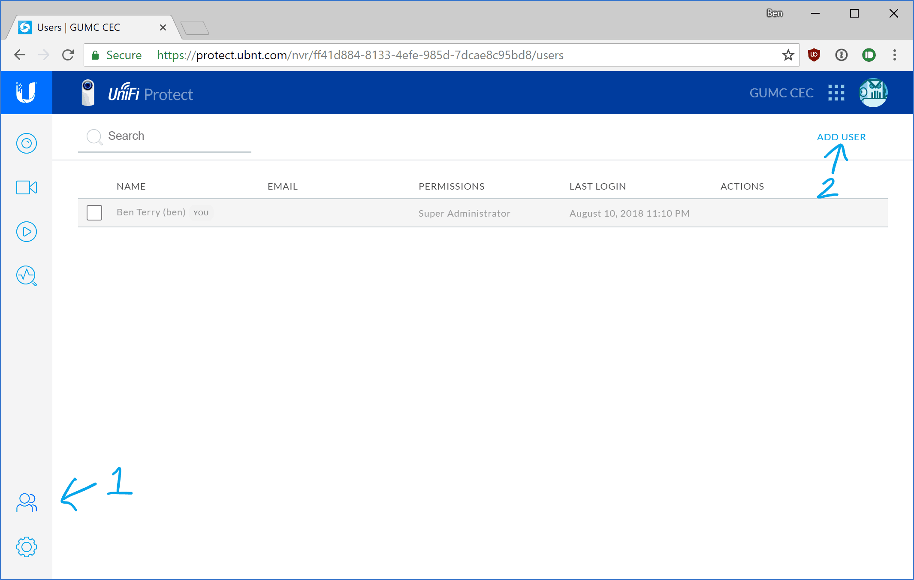

# UniFi Protect - Add a user

*Note: To add a new user to the GUMC CEC UniFi protect system, you will need to have administrator privileges.*

1. Log into the UFP system: https://protect.ubnt.com or the [local link](https://10.0.0.4:7443) (not recommended). See [here](ufp-login.html) for login instructions.

2. First, click on the **User** icon in the lower left. Then click **Add User** in the upper right.

   

3. Enter the user’s email address to invite them to log in with a Ubiquiti account. If a local account is preferred (not recommended), click **Use Username/Password**.

   

4. After you click **Send Invite**, you should see a dialog at the bottom of the screen informing you that the invitation send successfully and the user should be added to the list. If not, log out and try again.
   

   

5. Next, the user should follow [these instructions](ufp-acceptinvite.html) to accept the invite and complete their account.

------

[Back to UFP Docs list](https://BLTsndwch.github.io/GUMCdocs/UFPdocs/index.html)

*Updated 2018-08-12*