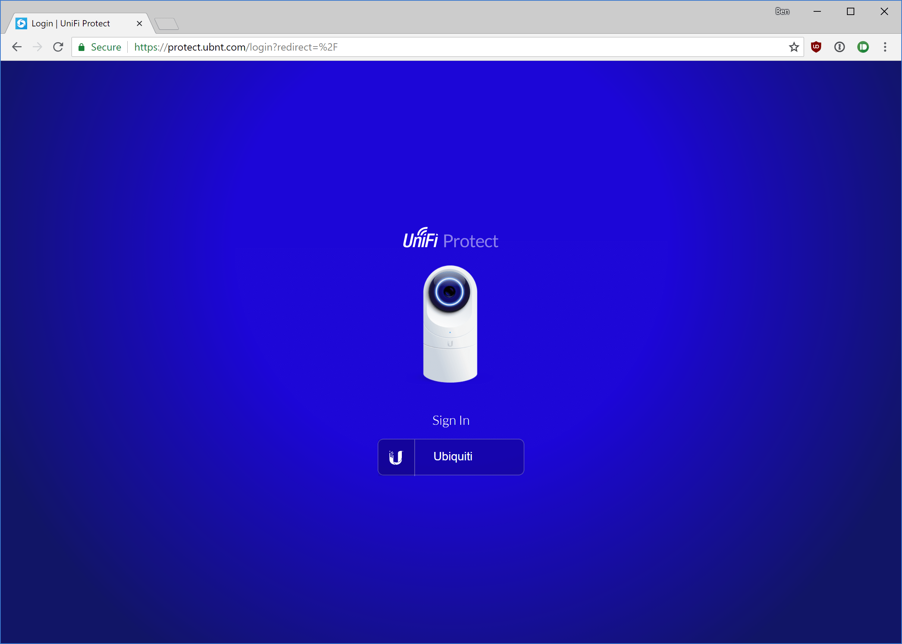
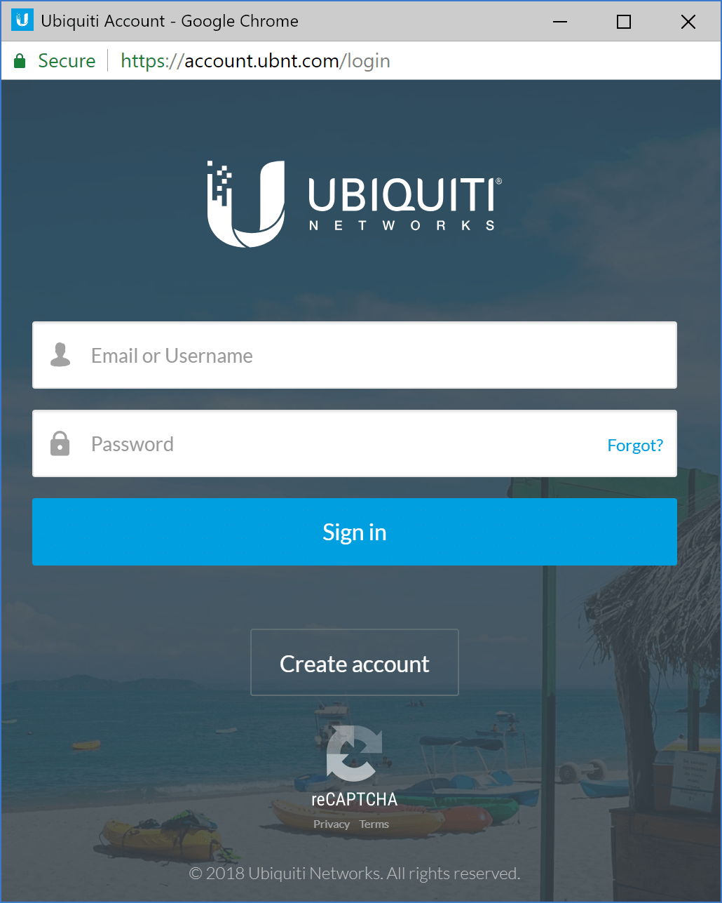
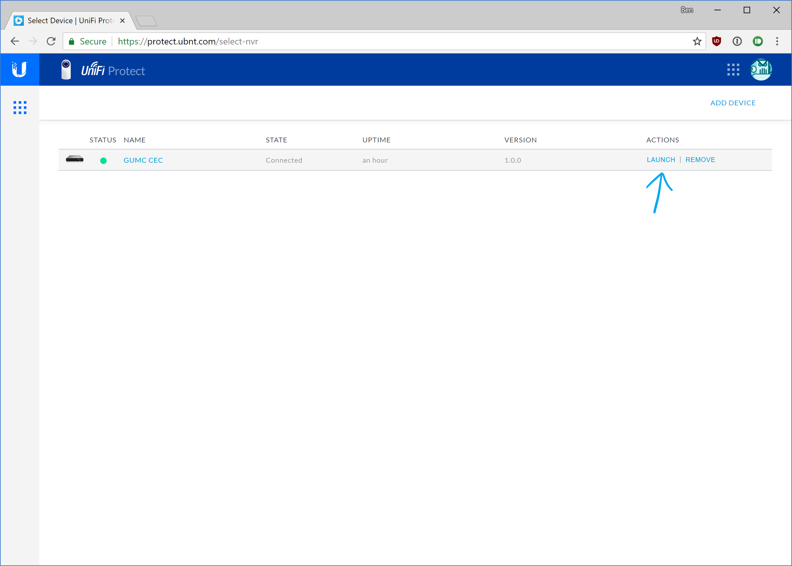
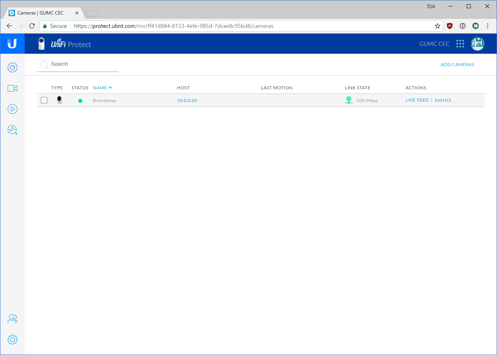

# UniFi Protect - Log In

1. With the Chrome web brower, go to https://protect.ubnt.com or the [local link](https://10.0.0.4:7443) (not recommended).

2. At the blue login screen, click the **Ubiquiti** account sign in button.
   

3. Enter your Ubiquiti account credentials.

   

   

4. If you are not automatically logged into the CEC NVR, click the **launch** button to the right of the *GUMC CEC* listing.

   

   

5. From the Protect home page, you can proceed to [view the live stream](/ufp-viewlive.html), view recordings, browse the timeline, manage users, and more depending on your account privileges.
   

Note that local access is not fully supported at this time. If the protect web portal is down or if CEC internet is down, you can log in to the local web page by visiting [this link](https://10.0.0.4:7443) and signing in with your Ubiquiti or local account. For now you will have to choose to continue past browser warning about a self signed SSL certificate; this will be fixed in the future. Local livestreaming of the camera with VLC will continue to work if internet is down. The system stores all recordings locally; internet is not required for NVR to function.

------

[Back to UFP Docs list](https://BLTsndwch.github.io/GUMCdocs/UFPdocs/index.html)

*Updated 2018-08-12*