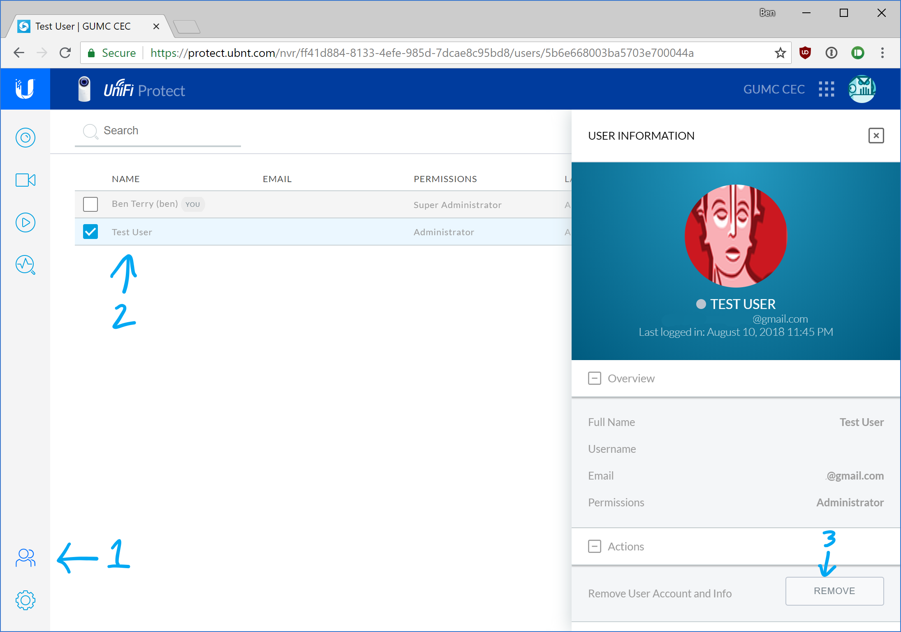

# UniFi Protect - Remove user

1. [Log into the system](ufp-login.html) with a administrator account.
2. Click the **Users** icon in the lower left. Next, select the user you with to delete. Scroll down to the bottom of the user pane to the right and click **Remove**. Note that all web portal access to the CEC UFP system will be revoked, but local (in building) streaming of the camera with VLC will continue to work until the streaming key is rotated. Contact Greg or Ben if this is needed.

------

[Back to UFP Docs list](https://BLTsndwch.github.io/GUMCdocs/UFPdocs/index.html)

*Updated 2018-08-12*