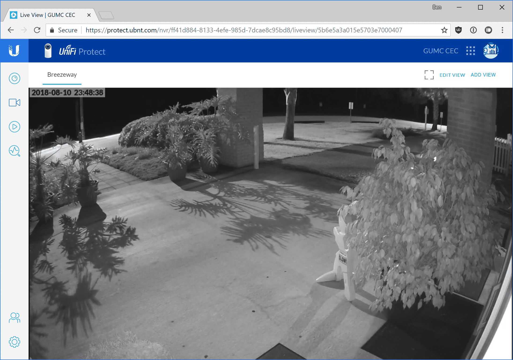

# UniFi Protect - View live

*Note: livestreaming to a mobile phone or tablet will be available soon. For now a PC/Mac running the Chrome browser or VLC is the only way to view the camera system.*

1. [Log into the system](ufp-login.html) using the Chrome web browser. *Note: some accounts may not have live viewing privileges granted. Contact an administrator if you can login but live viewing is not an option.*

2. You can view and camera from the UFP home page, but the live view page works better. Click on the **blue camera icon** in the left vertical navigation bar to go to the live view page.
   

   

3. For now, the default view of the Breezeway camera is the only useful view. In the future when more cameras are added you can click the blue underlined view name button in the upper left to choose another view. Click the square box corners button to the left of **Edit View** to go full screen. Press the escape key on your keyboard to exit full screen.

## Chrome alternative: VLC shortcuts on Windows

If livestreaming with the web portal in the Chrome browser is not working well, you can try using the VLC shortcuts provided by Ben in the original email. You will need [VLC](https://www.videolan.org/vlc/index.html) installed in the default directory for the shortcuts to work. Two sets of shortcuts are provided: one for 64-bit Windows PCs and one for 32-bit Windows PCs. Try the x64 shortcut first; if it doesn’t work try the x32 shortcut. If it still doesn’t work, the streaming key has rotated and you need to contact Ben to get a new set of shortcuts.

Streaming with VLC on MacOS, Linux, or other OS is also possible. You can find the streaming address on the camera management page for each camera. Contact Greg or Ben if you have questions.

------

[Back to UFP Docs list](https://BLTsndwch.github.io/GUMCdocs/UFPdocs/index.html)

*Updated 2018-08-12*