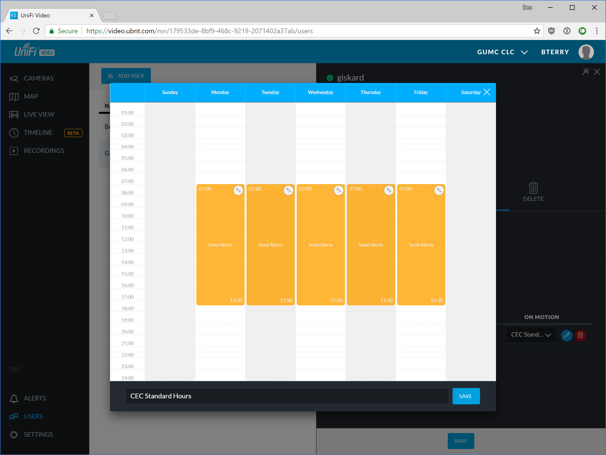

# Configuring motion alerts in UniFi Video

1. Log into the NVR with a administrator account.

2. Choose **Users** from the left side menu.
   
   

3. Click on the user who's alerts you want to manage. Next, choose the **Alerts** pane and expand the **Camera Alerts** section.
   

   

4. Choose the desired alert type and schedule. Push notifications are send to the iOS and Android app. *Always* will send an alert to the user every time the camera detects motion regardless of the day and time. To edit an existing schedule, select the schedule then click on the blue pencil button on the right. In the schedule editor, click and drag to create periods where motion alerts will be sent.
   

   

5. *Note: Ubiquiti accounts are required to receive push notifications with the iOS and Android apps. Local accounts can only receive email notifications.*

   ------

   [Return to UFV doc list](/GUMCdocs/UFVdocs/index.html)															

   *Updated 2018-07-07 for UFV 3.9.7*