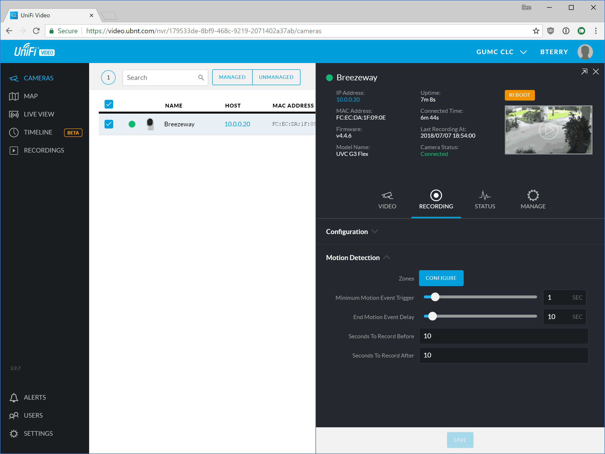
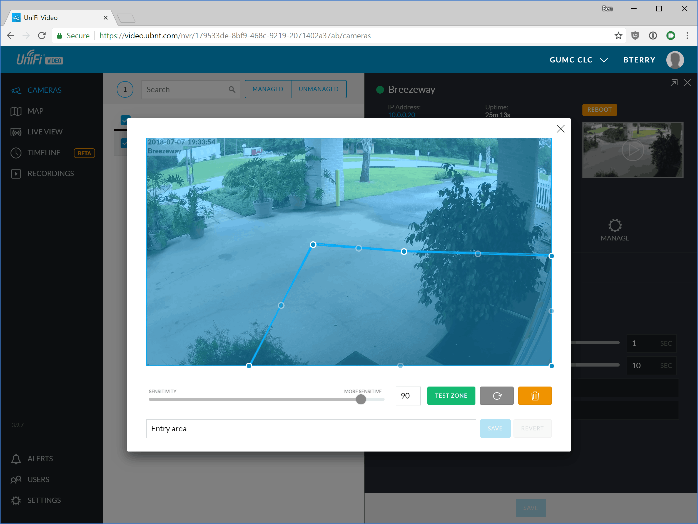

# Configuring motion detection in UniFi Video

1. Log into the NVR with an account with camera edit permissions.

2. Click on the camera you want to adjust. Next, choose the **Recording** tab and expand the **Motion Detection** area if it is not already expanded.
   

   - To fine tune motion detection, click on **Configure** zones. See next step for more detail.
   - The *Minimum Motion Event Trigger (MMET)* setting controls how long the camera must continue to sense motion before triggering a motion event. A value greater than 0 is recommended to avoid erroneous motion triggers such as lightning strikes. Too high a setting may result in the camera not capturing short events such as a car driving by.
   - The *End Motion Event Delay* slider sets a cooldown for how long the motion event lasts past when the camera stops detecting motion. This option is often functionally identical to *Seconds to Record After.*
   - *Seconds To Record Before* controls how many seconds of pre-roll buffer the NVR adds to the beginning of each motion recording. For example if the camera detects a person only right as the reach the door, the pre-roll buffer will capture how they approached the door. Motion detection is imperfect, so setting this to at least 10 seconds is recommended.
   - *Seconds To Record After* controls how many seconds of post-roll buffer the NVR adds to the end of each motion recording. This option is functionally identical to *End Motion Event Delay*, but only extends the video recording, not the "motion event." Motion detection is imperfect, so setting this to at least 10 seconds is recommended.

3. If motion detection is still not working as you want, you can fine tune the motion detection zones by clicking **Configure**. Click on a zone to select it. Once selected, you can rename, change the sensitivity of, reset, reshape, test, or delete the zone. Click and drag on the strong nodes to reshape the zone. Click on the faded nodes to add a new vertex to the polygon. Click on an area in the preview which is not covered by any zone to create a new zone. When testing a zone, activity in the histogram above the blue line indicates a motion event would be triggered.
   

4. *Note that motion detection settings apply to both recordings and to alerts. Changes to motion detection will apply system wide and **not** on a per-user basis.* 

   ------

   [Return to UFV doc list](/GUMCdocs/UFVdocs/index.html)															

   *Updated 2018-07-07 for UFV 3.9.7*