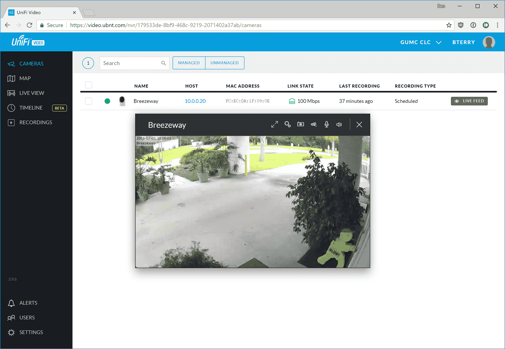
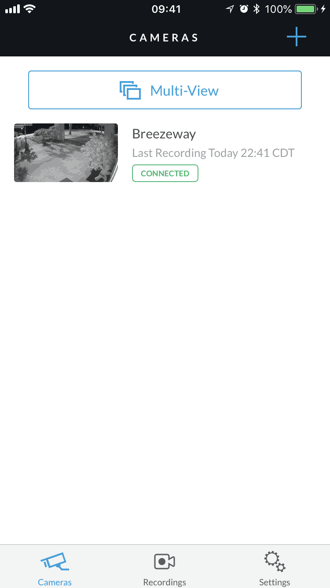

# Viewing a camera live in UniFi Video

### View the live stream with a computer (PC/Mac/Other):

1. Log into the NVR through [video.ubnt.com](htttps://video.ubnt.com/) or the [direct link](https://cecvideo.gonzalezmethodist.org:7443) using the Chrome web browser. *Note: Other browsers are currently unsupported.*

2. From the default **Cameras** menu, you can click on the live feed button to the right of each camera's row to pop out a viewing window. The menu options at the top of the pane listed left to right are: full screen, camera settings, download still image, set viewing quality, adjust volume, and close window. If you move the mouse cursor inside the pane, the zoom control bar will appear. The zoom does not affect recordings unless a Magic Zoom is set (available only on certain camera models).
   
   
   

3. Another way to view the camera is with the **Live View** menu. There, you can view up to 26 cameras simultaneously with customizable viewing presets. To mute camera audio, click **Edit View** and use the speaker icon on each video feed to toggle playback audio mute.
   

------

### Mobile phone or tablet:

1. Install the UniFi Video mobile app for [iOS](https://itunes.apple.com/us/app/unifi-video/id964967062) or [Android](https://play.google.com/store/apps/details?id=com.ubnt.unifivideo).  *Note: the following images are for iOS. The setup flow is similar on Android.*

2. *There are two options for logging in:*
   1. *Ubiquiti Account:*
      1. Login with your Ubiquiti account. 

         

         

   2. *Local Account:*
      1. If you created a local account instead of a Ubiquiti account, tap *Connect directly to your NVR* underneath the sign in button. *Note: you may need to tap in the blank space above the login fields to dismiss the keyboard.*

      2. Tap the three circles in the upper right, the tap **Add New NVR.**
         

         

      3. Enter `cecvideo.gonzalezmethodist.org` for the NVR address. Enter the login information you created or were given. Then, tap **Sign In**.

         

         

3. To view one camera’s live feed, tap on the camera when in the **Cameras** tab.
   

   

5. When viewing a camera, you can pinch or double tap to zoom in or out. Rotate the device to make the video full screen.
      

6. To view up to 4 cameras at once, tap the **Multi-View** button at the top of the cameras tab. You can customize each panel by tapping on it.

------

[Return to UFV doc list](/GUMCdocs/UFVdocs/index.html)															

*Updated 2018-07-03*