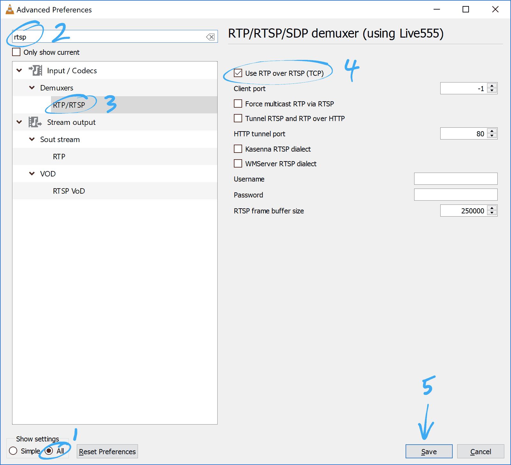

# Viewing a camera live feed with VLC

If using UniFi Video in Chrome on a computer is not working well, you can try streaming with VLC as an alternative. The following instructions are for Windows, but setup for VLC on Mac OS is similar. Note that VLC is best suited for viewing one camera at a time; UniFi Video in Chrome is likely to be a better experience for viewing multiple cameras. Contact Ben Terry if you have any issues with streaming a camera feed with VLC.

## Configuring VLC to work with UniFi Video live streams

1. Install [VLC media player](**https://www.videolan.org/vlc/**) (x64 bit preferred.)
2. Launch VLC. From the menu bar, choose **Tools**, then **Preferences.**
   
   
3. In the lower left, set the **Show settings** radio button to **All.** Next, type `rtsp` into the search box at the upper left. Select the *Input / Codecs* -> *Demuxers* -> **RTP/RTSP** list item. Then check *User RTP over RTSP (TCP)*. Click **Save** to save and close the preferences menu.
   
   
4. VLC should now be ready to stream UFV live feeds. 

## Streaming with VLC

### Easy option: Shortcut

1. Double click the shortcut file provided by the system administrator for the camera feed. VLC should launch and load the video feed within about 10 seconds.

   *Notes:*

   1. If 64 bit VLC was installed, use the x64 shortcut; use the x32 shortcut if 32 bit VLC was installed.
   2. If VLC was installed with non-default options, the shortcut may not be able to find VLC.exe
   3. The credentials needed to view the live feed may change in the future requiring the shortcut to be updated.

### Alternative option: Enter network source

1. Log into UniFi video in a web browser using a user account with `Camera Edit` privileges or full system Administrator. 
2. Select the camera, scroll down to the bottom of the *Video* tab, expand the **RTSP Service** box, and copy the desired stream URL.
3. In VLC, choose **Media** from the menu bar, click **Open Network Stream**, paste the stream URL, and click **Play**.

------

[Return to UFV doc list](/GUMCdocs/UFVdocs/index.html)															

*Updated 2018-07-06* for VLC 3.0.3 and UFV 3.9.7