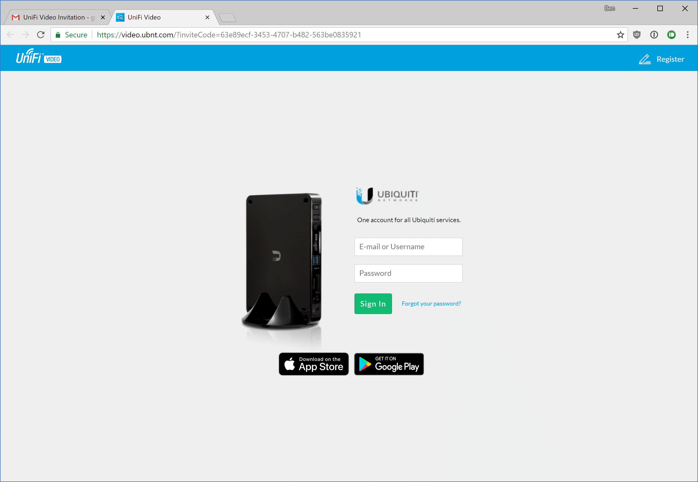

# Creating accounts in UniFi Video

### Inviting users (Ubiquiti account):

1. Log into an administrator account on the NVR through [video.ubnt.com](htttps://video.ubnt.com/) or the [direct link](https://cecvideo.gonzalezmethodist.org:7443). *Note: Only administrator accounts can manage other accounts.*

2. From the navigation bar on the left, select **Users** then click **Add User**.
   

   

3. Fill in the **Name, Email Address, and User Group**. Local Access and API Access can be ignored.

   

   

4. *Optional:* Configure the user's alert settings.
   

   

5. Click **Save**. You should see a success message.
   

------

### Setting up an account:

1. Open the invitation email and click login.
   

   

2. If you already have a Ubiquiti account, log in here. Otherwise, click register at the top right.
   

   

3. Fill in the info then click **Create Account**. ***Note: The email address must match the invited email address.***
   

   

4. Done! If you are not automatically logged in, go to [video.ubnt.com](htttps://video.ubnt.com/) or the [direct link](https://cecvideo.gonzalezmethodist.org:7443) and login with your new account.
   

------

[Return to doc list](/GUMCdocs/UniFiVideoDocs/index.html)															

*Updated 2018-07-01*