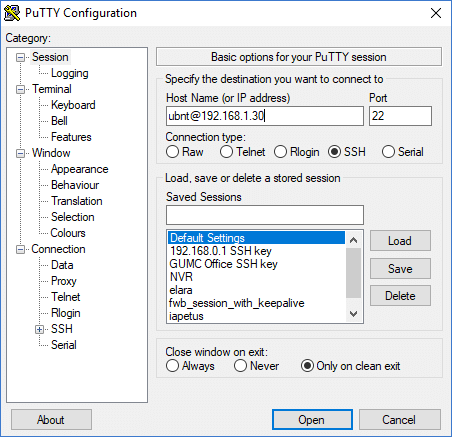
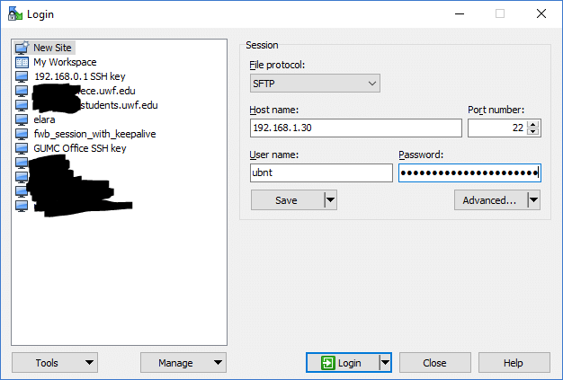
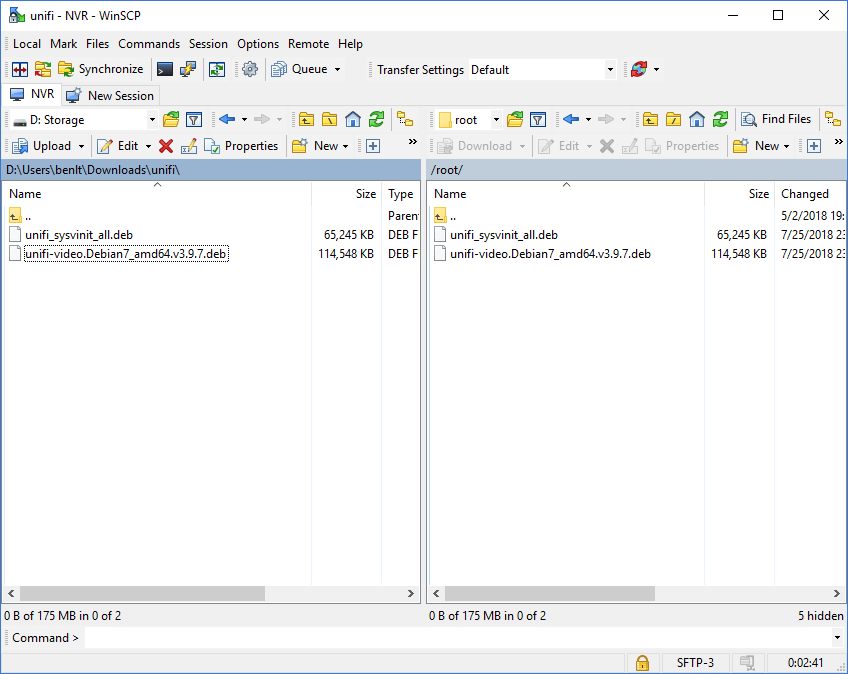

## Setting up UniFi SDN on a UVC-NVR without a LAN

1. Download a the UniFi SDN Controller package for Debian from [Ubiquiti's download site](https://www.ubnt.com/download/unifi). While you're there, you can also download the latest version of UniFi Video for Debian.

2. Follow the instructions titled *"Direct Connection to the UniFi NVR"* in the UVC-NVR Quick Start Guide. 

   ##### Static IP instructions: 

   1. Open Windows 10 Setting and select *Network & Internet*. 
   2. Select *Ethernet* from the left side list, then click *Change adapter options*. 
   3. Right click on your ethernet interface and open *Properties*.
   4. Double click on *Internet Protocol Version 4 (TCP/IPv4)*.
   5. Select the "Use the following IP address:" radio button, enter an IP (ex `192.168.1.70`), and click *OK*.  You can leave the *Default Gateway* blank and DNS server on auto.

3. Go back to the NVC configuration portal by going to `http://192.168.1.30` with a web browser.

4. Click the gears on the upper right. Default username and password: `ubnt`  `ubnt`.

5. Go to the **Maintenance** tab and set a new, very strong password. [This site](http://correcthorsebatterystaple.net/) can help choose a strong passphrase for NVR configuration/SSH. The username/password for NVR configuration is separate from the UniFi video username/password. The username for NVR configuration and SSH will remain `ubnt`. The by default, SSH login will be root, so a strong password is imperative.

6. SSH into `ubnt@192.168.1.30` with your new password. PuTTY example shown below. You will be prompted for your password after you click **Open**.
   
   

7. If it worked, open a SFTP connection to the NVR with WinSCP.
   
   

8. Browse to `/root/`, select your packages to upload on the left pane, and click **Upload**.
   
   

9. If you go back to your SSH session, type `ls`, and press enter, you should see the two packages listed.

10. Install UniFi with the command `dpkg -i  unifi_sysvinit_all.deb`. *Tip: tab autocompletes.* Similar for UniFi Video.

11. If you are extremely lucky, you had no dependency problems and were able to install UniFi SDN. Chances are you at least needed a recent Java runtime. You can try to hunt that package down and repeat the SFTP, dpkg processes, but its likely to be an exercise in frustration. Instead, wait until you have a LAN with internet and follow the other instructions to let apt handle dependencies.